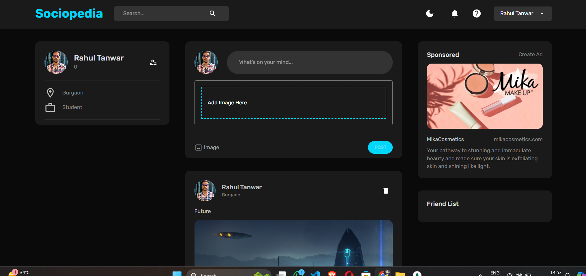

# Social Media Application using MERN Stack

## Table of Contents
- [Introduction](#introduction)
- [Features](#features)
- [Tech Stack](#tech-stack)

## Introduction
This project is a social media application built using the MERN stack (MongoDB, Express.js, React.js, Node.js). The application allows users to register, log in, create posts, and interact with other users by liking and commenting on posts.

## Features
- User Authentication (Sign Up, Log In)
- Profile Management
- Create, Read, Delete Posts
- Like on Posts
- Upload and display user profile pictures
- Responsive Design

## Tech Stack
- **Frontend:** React.js
- **Backend:** Node.js, Express.js
- **Database:** MongoDB
- **Authentication:** JWT, bcrypt
- **File Uploads:** Multer

  ## ScreenShots

  
